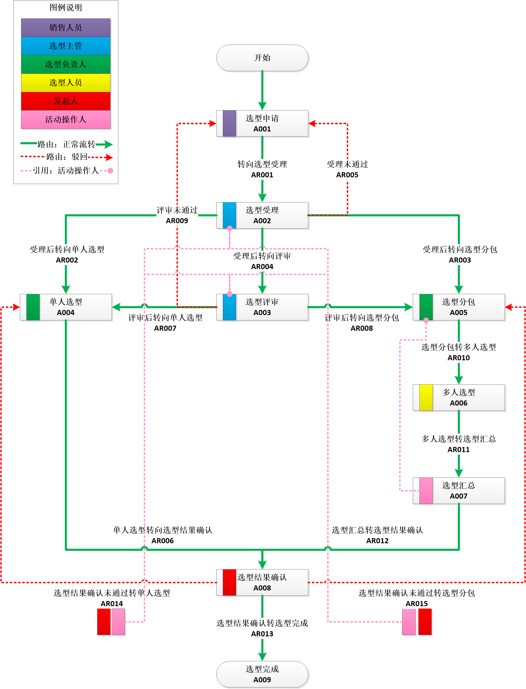
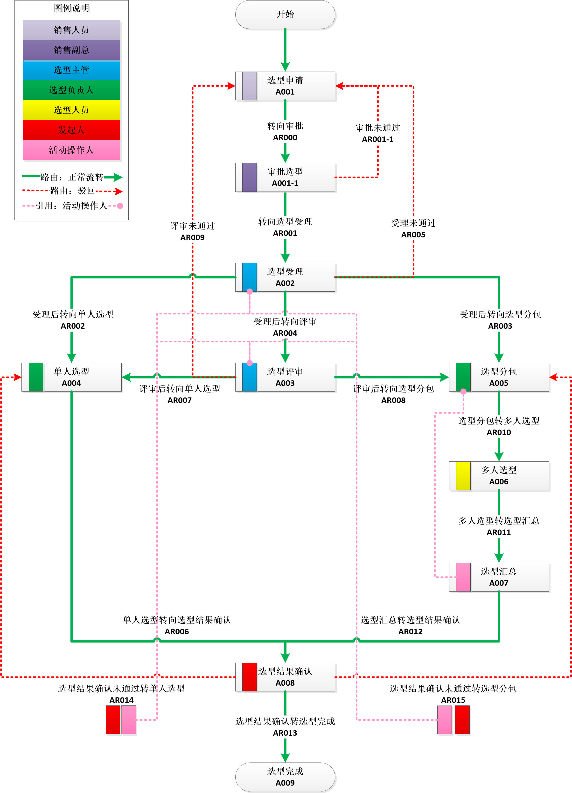
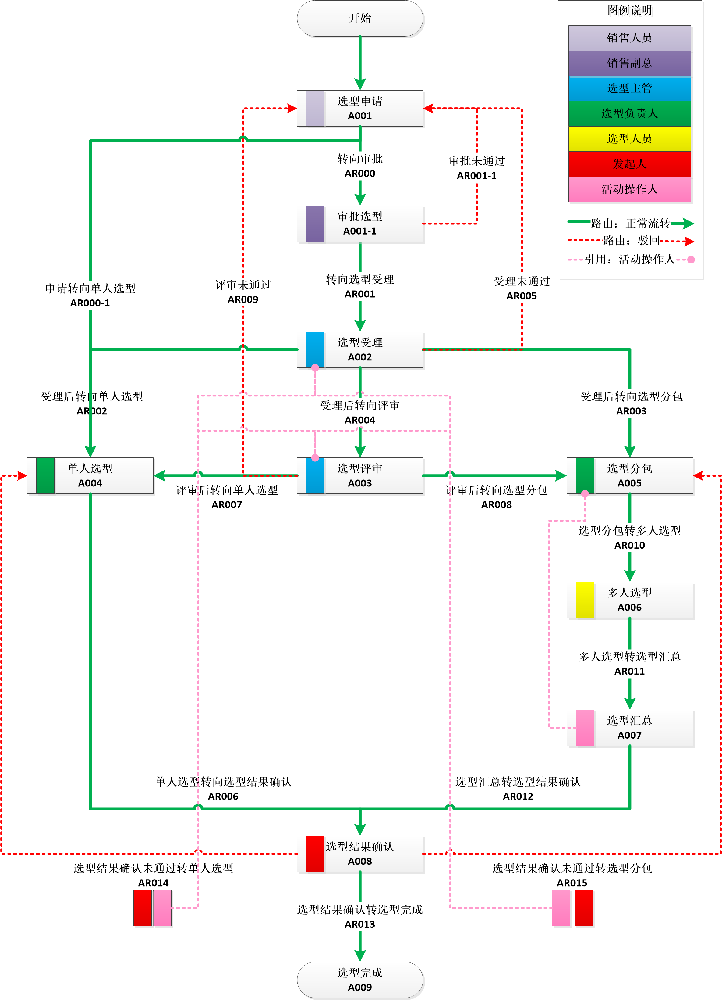

# XFlowEngine

工作流引擎
------

实战流程案例：智能选型v1.0.0版本
------

实战流程案例：智能选型v2.0.0版本（增加审批环节）
------

实战流程案例：智能选型v3.0.0版本（增加单人协助路由）
------

---
#### 本项目引用Jar包，其源码链接如下
引用 https://github.com/HY-ZhengWei/XFlowEngineClient 类库

引用 https://github.com/HY-ZhengWei/hy.common.base 类库

引用 https://github.com/HY-ZhengWei/hy.common.db 类库

引用 https://github.com/HY-ZhengWei/hy.common.file 类库

引用 https://github.com/HY-ZhengWei/hy.common.net 类库

引用 https://github.com/HY-ZhengWei/hy.common.tpool 类库

引用 https://github.com/HY-ZhengWei/XJava 类库
